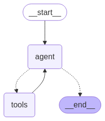

# 🧠 无需代理的LLM网络搜索引擎

一个无需代理的多搜索引擎 LLM 网络检索工具，支持 URL 内容解析和网页爬取，结合 LangGraph 实现模块化智能体链路。专为大语言模型的外部知识调用场景而设计，支持 **Playwright + Crawl4AI** 网页获取与解析，支持异步并发、内容切片与重排过滤。

## ✨ 特性一览

- 🌐 **无需代理**：通过 Playwright 配置国内浏览器支持，无需代理也能进行网络搜索。

- 🔍 **多搜索引擎支持**：支持 Bing、夸克、百度、搜狗 等主流搜索引擎，增强信息来源多样性。

- 🤖 **意图识别**：系统能够根据用户的输入内容，自动判断是进行网络搜索还是解析 URL。

- 🔄 **查询分解**：根据用户的搜索意图，自动将查询分解为多个子任务，并依次执行，从而提升搜索的相关性与效率。

- ⚙️ **智能体架构**：基于 **LangGraph** 封装的**「web_search」**与**「link_parser」**。

- 🏃‍♂️ **异步并发任务处理**：支持异步并发任务处理，可高效处理多个搜索任务。

- 📝 **内容处理优化**：

  - ✂️ **内容切片**：将网页长内容按段切分。

  - 🔄 **内容重排**：智能重排序，提高信息相关性。

  - 🚫 **内容过滤**：自动剔除无关或重复内容。

- 🌐 **多端支持**：

  - 🖥️ 提供 FastAPI 后端接口，可集成到任意系统中。

  - 🌍 提供 Gradio Web UI，可快速部署成可视化应用。




## ⚡ 快速开始

### 1. 克隆仓库

```bash
git clone https://github.com/itshyao/proxyless-llm-websearch.git
cd proxyless-llm-websearch
```

### 2. 安装依赖

```
pip install -r requirements.txt
python -m playwright install
```

### 3. 快速开始

#### 环境变量配置

```
OPENAI_API_KEY=xxx
OPENAI_BASE_URL=https://ark.cn-beijing.volces.com/api/v3
MODEL_NAME=deepseek-v3-250324

EMBEDDING_MODEL_NAME=doubao-embedding-large-text-240915
EMBEDDING_API_KEY=xxx
EMBEDDING_BASE_URL=https://ark.cn-beijing.volces.com/api/v3
```

#### demo

```python
'''
python demo.py
'''

from pools import BrowserPool, CrawlerPool
from agent import ToolsGraph
import asyncio

async def main():
    browser_pool = BrowserPool(pool_size=1)
    crawler_pool = CrawlerPool(pool_size=1)
    
    graph = ToolsGraph(browser_pool, crawler_pool, engine="bing")

    await browser_pool._create_browser_instance(headless=True)
    await crawler_pool._get_instance()

    result = await graph.run("langgraph到底该怎么使用?")

    await browser_pool.cleanup()
    await crawler_pool.cleanup()

    print(result)

if __name__ == "__main__":
    asyncio.run(main())
```

#### 后端api

```python
'''
python api_serve.py
'''
import requests
import json


url = "http://localhost:8000/search"  

data = {
    "question": "langgraph到底该怎么使用?"  
}

try:
    response = requests.post(
        url,
        json=data
    
    if response.status_code == 200:
        print("✅ 请求成功！")
        print("响应内容：", response.json())
    else:
        print(f"❌ 请求失败，状态码：{response.status_code}")
        print("错误信息：", response.text)

except requests.exceptions.RequestException as e:
    print(f"⚠️ 请求异常：{str(e)}")
```

#### gradio_demo

```
python gradio_demo.py
```


## 🔍 与线上网络检索测试对比

我们将项目与一些主流的在线 API 进行对比，评估了其在复杂问题下的表现。

### 🔥 数据集

- 数据集来自阿里发布的 [WebWalkerQA](https://huggingface.co/datasets/callanwu/WebWalkerQA)，包含了 680 个高难度问题，覆盖教育、学术会议、游戏等多个领域。
- 数据集包括中英文问题。

### 🧑‍🏫 对比结果

| 搜索引擎/系统  | ✅ Correct | ❌ Incorrect | ⚠️ Partially Correct |
| -------------- | --------- | ----------- | ------------------- |
| **火山方舟**   | 5.00%     | 72.21%      | 22.79%              |
| **百炼**       | 9.85%     | 62.79%      | 27.35%              |
| **BingSearch** | 19.85%    | 47.94%      | 32.06%              |

## 🙏 致谢

本项目部分功能得益于以下开源项目的支持与启发，特此致谢：

- 🧠 [LangGraph](https://github.com/langchain-ai/langgraph)：用于构建模块化智能体链路框架。
- 🕷 [Crawl4AI](https://github.com/unclecode/crawl4ai)：强大的网页内容解析工具。